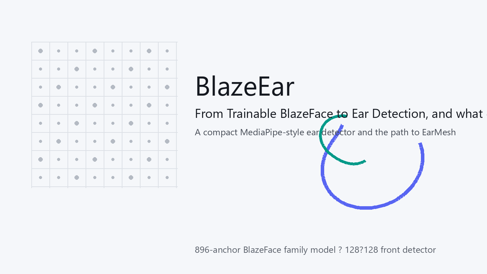
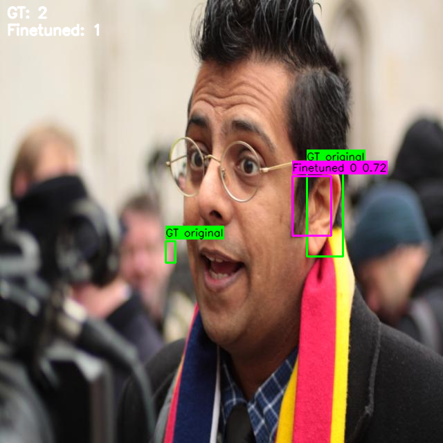
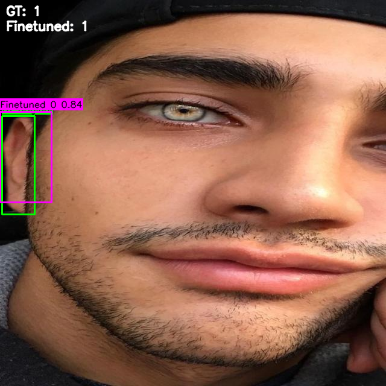

# BlazeEar



BlazeEar is a lightweight ear detector built on the MediaPipe BlazeFace family of models. The goal is practical ear localization in unconstrained images (profiles, partial occlusions, mixed lighting) with a compact architecture that can run in real time on consumer GPUs and edge devices.

The project started as an experiment to reuse BlazeFace’s anchor layout and training recipe for a different small target (ears). Early versions relied on external detectors to generate pseudo‑labels; the current codebase supports a full pipeline from heterogeneous annotations to a trained BlazeEar model, with optional staged fine‑tuning and tooling for qualitative inspection.

---

## Motivation and Evolution

### Initial phase

- Many open ear datasets are small, biased, or inconsistently annotated.  
- BlazeFace provides a proven, low‑latency detector with a fixed 896‑anchor layout.  
- The first iteration focused on “can BlazeFace anchors + loss learn ears at all?”, using automatic boxes from a YOLO ear detector and pose keypoints to bootstrap training data.

### Current state

- A unified data preparation pipeline merges multiple annotation sources into a single CSV with provenance.  
- The BlazeEar model is a BlazeFace‑style front detector (128×128 input) with ear‑specific training, hard negative mining, and optional focal loss.  
- Debug and visualization scripts help compare BlazeEar to baseline detectors and export sample predictions.

---

## Lineage: Trainable BlazeFace → BlazeEar

This repository is a direct descendant of the sibling project `trainable_blazeface/` (one folder above this repo). That earlier work solved a specific technical problem: MediaPipe’s published BlazeFace weights are “inference‑only”. BatchNorm statistics are folded into convolution weights and the TensorFlow Lite graph cannot backpropagate. `trainable_blazeface` reintroduced trainable BatchNorm into the BlazeBlocks, unfolded the pretrained parameters into those layers, and verified that the PyTorch model produces the same outputs as MediaPipe at initialization.

Once BlazeFace was trainable end‑to‑end, it became a stable platform for adapting the detector to other small, roughly face‑adjacent targets. Ears are similar enough to faces to benefit from the same anchor pyramid and receptive fields, but different enough to expose the limitations of existing ear datasets and off‑the‑shelf detectors.

What carried over unchanged:

- The front‑detector backbone (`BlazeBlock_WT` stack), two‑scale heads, and 896‑anchor layout.  
- The training recipe from `vincent1bt/blazeface‑tensorflow`: anchor target encoding, hard negative mining, and SmoothL1 regression.  
- Weight initialization via `load_mediapipe_weights()` and the same preprocessing/NMS conventions.

What changed to become BlazeEar:

- `blazeface.py` became `blazeear.py` with identical topology but a new task label.  
- `data_prep.py` expanded from “single‑format face boxes” to a multi‑source ear annotation merger with provenance and optional pseudo‑labeling.  
- Training defaults and debug tooling shifted to ear‑specific thresholds and failure modes.

In short: `trainable_blazeface` made BlazeFace trainable; BlazeEar uses that foundation to address ear localization with a purpose‑built dataset pipeline and training run.

---

## Repository Structure

- `blazebase.py`  
  Core BlazeBase utilities: preprocessing, anchor generation, TFLite‑compatible padding, and MediaPipe weight loader.
- `blazedetector.py`  
  Base detector class with MediaPipe preprocessing, batched inference, NMS, and a `get_training_outputs()` path that bypasses post‑processing.
- `blazeear.py`  
  BlazeEar architecture. Outputs 896 anchors (512 from 16×16×2 + 384 from 8×8×6). Regressor outputs 16 coords per anchor (4 box + 6 keypoints ×2), though only box coords are supervised by default.
- `train_blazeear.py`  
  Full training pipeline: CSV/NPY dataloading, anchor target encoding, loss, metrics, mixed precision, checkpointing, and TensorBoard logging.
- `data_prep.py`  
  Annotation unification and split generation. Merges COCO/CSV/PTS/LFPW and optional automatic sources (YOLO ear detector, pose ears). Produces `data/splits/train.csv` and `data/splits/val.csv`.
- `dataloader.py`  
  CSV dataset with resize‑pad to square, strong augmentations, and encoding into BlazeFace anchors via `utils/anchor_utils.py`.
- `loss_functions.py`  
  `BlazeEarDetectionLoss`: hard negative mining + BCE or focal classification + SmoothL1 regression.
- `finetune_yolov11.py`  
  Converts BlazeEar CSV metadata into YOLO format and fine‑tunes an Ultralytics YOLOv11 ear detector (useful for bootstrapping or comparison).
- `utils/`  
  Anchor helpers, augmentations, visualization, metric utilities, debug scripts, and tests.
- `runs/`  
  Training artifacts. `runs/checkpoints/` contains saved `.pth` weights, and `runs/logs/` holds TensorBoard events and debug screenshots.

---

## Architecture

BlazeEar matches the MediaPipe BlazeFace front detector topology. The network is a small two‑stage BlazeBlock backbone followed by two detection heads operating at different strides.

```text
Input RGB image (H×W×3)
        │
        ▼
Resize + pad to square
Resize to 128×128
        │
        ▼
Conv 5×5 s=2, 24ch
        │
        ▼
Backbone1: BlazeBlock_WT stack
  → feature map 16×16×88
        │
   ┌────┴─────────────┐
   │                  │
   ▼                  ▼
Classifier_8          Regressor_8
16×16 grid            16×16 grid
2 anchors/cell        2 anchors/cell
512 scores            512 box+kp preds
   │                  │
   └──────┬───────────┘
          │
          ▼
Backbone2: BlazeBlock_WT stack
  → feature map 8×8×96
          │
   ┌────┴─────────────┐
   │                  │
   ▼                  ▼
Classifier_16         Regressor_16
8×8 grid              8×8 grid
6 anchors/cell        6 anchors/cell
384 scores            384 box+kp preds
   │                  │
   └──────┬───────────┘
          │
          ▼
Concat across scales
  scores: (896, 1) logits
  boxes:  (896, 16) raw coords
          │
          ▼
Decode + sigmoid + NMS
→ final ear detections
```

Anchor pyramid:

- Small scale: 16×16 grid with 2 anchors per cell (512 anchors).  
- Large scale: 8×8 grid with 6 anchors per cell (384 anchors).  
- Total: 896 anchors, each predicting 1 class score and 16 regression values (4 box + 12 keypoint coords).

---

## Pipeline Dataflow

End‑to‑end flow from raw data to a trained model:

```text
Raw datasets under data/raw/
  COCO / CSV / PTS / LFPW
        │
        ▼
data_prep.py
  - decode annotations
  - optional YOLO ear boxes
  - optional pose ear keypoints
  - merge + de‑duplicate
        │
        ▼
master.csv (with annotation_source)
        │
        ├───────────────┐
        ▼               ▼
train.csv           val.csv
        │               │
        ▼               ▼
CSVDetectorDataset (dataloader.py)
  - load image
  - resize/pad to 128×128
  - augment (color + geometry + occlusion)
  - normalize boxes
  - encode to anchors (utils/anchor_utils.py)
        │
        ▼
train_blazeear.py
  - get_training_outputs()
  - BlazeEarDetectionLoss
  - hard negative mining
  - AMP / freeze‑thaw optional
        │
        ▼
runs/checkpoints/*.pth
runs/logs/BlazeEar/*
        │
        ▼
utils/debug_training.py
  - qualitative screenshots
  - metric sweeps / comparisons
```

---

## Installation

1. Create an environment (Python 3.10+ recommended).
2. Install dependencies:

```bash
pip install -r requirements.txt
```

Notes:

- Training and debug scripts expect PyTorch and Ultralytics.  
- CUDA is optional but strongly recommended for training.

---

## Data Preparation

Raw data should live under `data/raw/` in any of the supported formats. The prep script walks subfolders, decodes annotations, and produces a single metadata table.

```bash
python data_prep.py \
  --data-root data/raw \
  --output-csv data/splits/master.csv \
  --train-csv data/splits/train.csv \
  --val-csv data/splits/val.csv
```

Key behaviors:

- Supports COCO JSON, CSV, PTS, and LFPW TXT formats via `utils/data_decoder.py`.  
- Optional pseudo‑labeling with Ultralytics YOLO and ear keypoints from a pose model.  
- Each box records an `annotation_source` value (e.g., `GT`, `EAR`, `POSE`, `GT+EAR`) to preserve provenance.

---

## Training BlazeEar

The primary path is CSV training that mirrors the MediaPipe front detector setup:

```bash
python train_blazeear.py --csv-format \
  --train-data data/splits/train.csv \
  --val-data data/splits/val.csv \
  --data-root data/raw/blazeear
```

Useful flags:

- `--init-weights mediapipe|scratch`  
  Load MediaPipe BlazeFace weights (`model_weights/blazeface.pth`) or random init.
- `--freeze-thaw`  
  Staged training: heads only → backbone2 → full model (see script defaults).
- `--use-focal-loss --focal-alpha 0.25 --focal-gamma 2.0`  
  Switch from BCE to focal loss.
- `--amp / --no-amp`  
  Mixed precision toggle.
- `--resume runs/checkpoints/BlazeEar_epochXX.pth`  
  Resume from an explicit checkpoint.

Outputs:

- Checkpoints in `runs/checkpoints/` (best model at `runs/checkpoints/BlazeEar_best.pth`).  
- TensorBoard logs in `runs/logs/BlazeEar/`.

To view logs:

```bash
tensorboard --logdir runs/logs
```

---

## Training Results (current run)

From `runs/logs/BlazeEar/events.out.tfevents.*`:

- Trained for **100 epochs** with cosine annealing LR from **1e‑4 → ~1e‑6**.  
- Best validation **mAP@0.5 ≈ 0.46** (peak during training).  
- Best validation **mean IoU ≈ 0.46**.  
- Final validation snapshot: mAP@0.5 ≈ **0.25**, mean IoU ≈ **0.33**.  

Qualitative samples are exported to `runs/logs/debug_images/`. These PNGs show predicted boxes over diverse poses and occlusions and are useful for spotting failure modes (small ears, heavy occlusion, extreme profiles).

Examples (from this run):





---

## Inference and Debugging

The simplest programmatic usage:

```python
from blazeear import BlazeEar
import torch

model = BlazeEar()
model.load_weights("runs/checkpoints/BlazeEar_best.pth")
model.to("cuda").eval()

# img: numpy HxWx3 RGB
dets = model.process(img)  # returns boxes in original image space
```

Utilities:

- `utils/image_demo.py` and `utils/webcam_demo.py`  
  Run BlazeEar on images or webcam streams.
- `utils/debug_training.py`  
  Compare BlazeEar vs MediaPipe weights, dump debug screenshots, and run quick eval loops.

Example screenshot export:

```bash
python utils/debug_training.py \
  --weights runs/checkpoints/BlazeEar_best.pth \
  --data-root data/raw/blazeear \
  --csv data/splits/val.csv \
  --screenshot-count 20
```

---

## Optional: Fine‑tune YOLOv11 Ear Detector

If you want a stronger pseudo‑labeler or baseline:

```bash
python finetune_yolov11.py \
  --train-csv data/splits/train.csv \
  --val-csv data/splits/val.csv \
  --data-root data/raw \
  --weights yolo11n.pt \
  --epochs 100
```

This script converts the CSVs into YOLO format under `data/yolo11_ears/` and launches Ultralytics training in `runs/yolo11/`.

---

## Testing

Unit tests live under `utils/tests/`.

```bash
pytest
```

---

## Next Directions

Areas that naturally follow from the current pipeline:

- Add explicit ear keypoint supervision if labels become available (regressor heads already exist).  
- Calibrate detection thresholds for different operating points (front‑facing vs profile).  
- Export to ONNX/TFLite for edge deployment.
