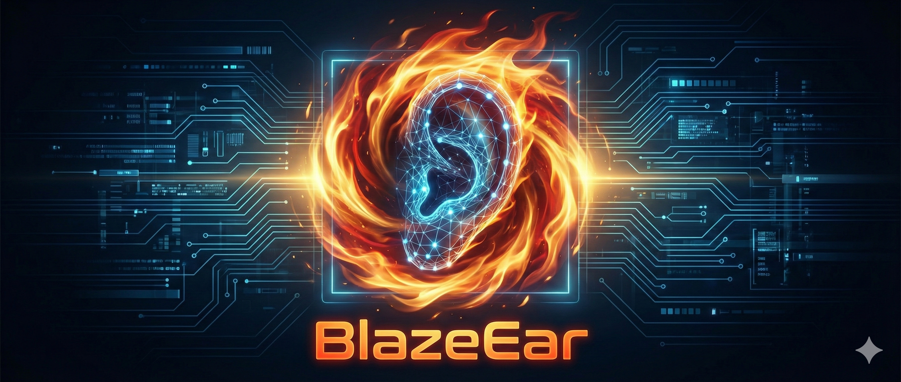
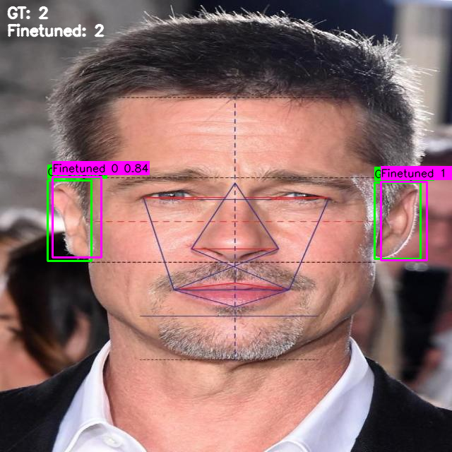
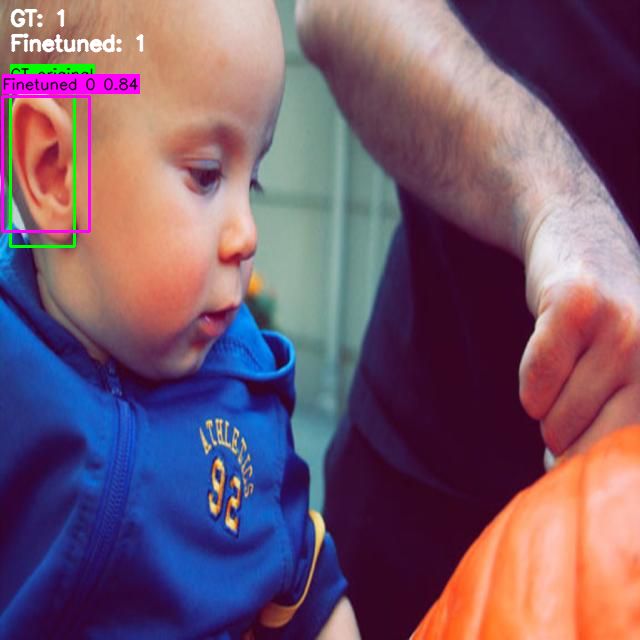
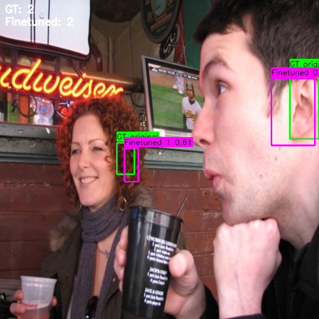
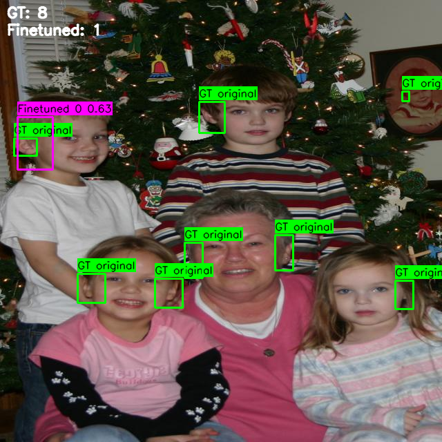
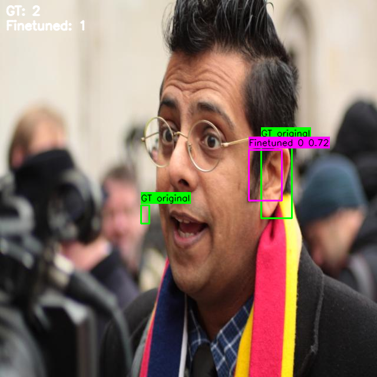
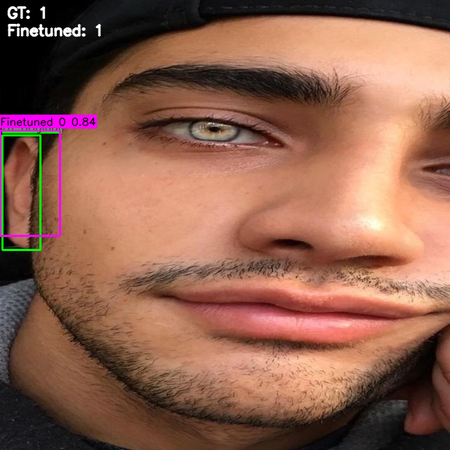

# BlazeEar



**[Live demo](https://shameem4.github.io/BlazeEar/)** &mdash; runs entirely in
your browser, on your device. No image leaves the page.

**Write-ups:**
[Measuring the whole head, privately, in the browser](https://www.linkedin.com/m/pulse/measuring-whole-head-privately-browser-shameem-hameed-ep0mc)
&middot;
[BlazeEar: extending trainable BlazeFace from faces to ears](https://www.linkedin.com/pulse/blazeear-extending-trainable-blazeface-from-faces-ears-shameem-hameed-dalic/)

> Note on the earlier article: it reports a peak validation mAP@0.5 of about
> 0.46 declining to 0.25. Both figures are withdrawn -- they were an artifact
> of an unshuffled validation prefix ordered by annotation source. See
> [v2: what changed](#v2-what-changed-and-what-it-was-worth) for the
> corrected numbers and how they were measured.

BlazeEar is a lightweight ear detector built on the MediaPipe BlazeFace family of models. The goal is practical ear localization in unconstrained images (profiles, partial occlusions, mixed lighting) with a compact architecture that can run in real time on consumer GPUs and edge devices.

The project started as an experiment to reuse BlazeFace’s anchor layout and training recipe for a different small target (ears). Early versions relied on external detectors to generate pseudo‑labels; the current codebase supports a full pipeline from heterogeneous annotations to a trained BlazeEar model, with optional staged fine‑tuning and tooling for qualitative inspection.

---

## Motivation and Evolution

### Initial phase

- Many open ear datasets are small, biased, or inconsistently annotated.  
- BlazeFace provides a proven, low‑latency detector with a fixed 896‑anchor layout.  
- The first iteration focused on “can BlazeFace anchors + loss learn ears at all?”, using automatic boxes from a YOLO ear detector and pose keypoints to bootstrap training data.

### Current state

- A unified data preparation pipeline merges multiple annotation sources into a single CSV with provenance.  
- The BlazeEar model is a BlazeFace‑style front detector (128×128 input) with ear‑specific training, hard negative mining, and optional focal loss.  
- Debug and visualization scripts help compare BlazeEar to baseline detectors and export sample predictions.

---

## Lineage: Trainable BlazeFace → BlazeEar

This repository is a direct descendant of the sibling project `trainable_blazeface/` (one folder above this repo). That earlier work solved a specific technical problem: MediaPipe’s published BlazeFace weights are “inference‑only”. BatchNorm statistics are folded into convolution weights and the TensorFlow Lite graph cannot backpropagate. `trainable_blazeface` reintroduced trainable BatchNorm into the BlazeBlocks, unfolded the pretrained parameters into those layers, and verified that the PyTorch model produces the same outputs as MediaPipe at initialization.

Once BlazeFace was trainable end‑to‑end, it became a stable platform for adapting the detector to other small, roughly face‑adjacent targets. Ears are similar enough to faces to benefit from the same anchor pyramid and receptive fields, but different enough to expose the limitations of existing ear datasets and off‑the‑shelf detectors.

> **Correction (v2).** Until the v2 branch, `BlazeEar` built its entire backbone
> from `BlazeBlock_WT` — the *folded* block, with BatchNorm baked into the conv
> weights. `BlazeBlock`, the trainable-BatchNorm block this lineage exists to
> provide, was never instantiated, so the shipped model had **no normalization
> layers at all** and the central claim below was not true of it. Worse, the
> conversion path was unreachable: `load_mediapipe_weights` chose it inside an
> `except RuntimeError`, but `load_state_dict(strict=False)` does not raise on
> missing keys, so loading into a BatchNorm backbone reported success while
> leaving 160 keys missing. Both are fixed; eval-mode parity with the folded
> model at initialization is now 1.2e-4 relative.

What carried over unchanged:

- The front‑detector backbone, two‑scale heads, and 896‑anchor layout.  
- The training recipe from `vincent1bt/blazeface‑tensorflow`: anchor target encoding, hard negative mining, and SmoothL1 regression.  
- Weight initialization via `load_mediapipe_weights()` and the same preprocessing/NMS conventions.

What changed to become BlazeEar:

- `blazeface.py` became `blazeear.py` with identical topology but a new task label.  
- `data_prep.py` expanded from “single‑format face boxes” to a multi‑source ear annotation merger with provenance and optional pseudo‑labeling.  
- Training defaults and debug tooling shifted to ear‑specific thresholds and failure modes.

In short: `trainable_blazeface` made BlazeFace trainable; BlazeEar uses that foundation to address ear localization with a purpose‑built dataset pipeline and training run.

---

## Repository Structure

- `blazebase.py`  
  Core BlazeBase utilities: preprocessing, anchor generation, TFLite‑compatible padding, and MediaPipe weight loader.
- `blazedetector.py`  
  Base detector class with MediaPipe preprocessing, batched inference, NMS, and a `get_training_outputs()` path that bypasses post‑processing.
- `blazeear.py`  
  BlazeEar architecture. Outputs 896 anchors (512 from 16×16×2 + 384 from 8×8×6). Regressor outputs 16 coords per anchor (4 box + 6 keypoints ×2), though only box coords are supervised by default.
- `train_blazeear.py`  
  Full training pipeline: CSV/NPY dataloading, anchor target encoding, loss, metrics, mixed precision, checkpointing, and TensorBoard logging.
- `data_prep.py`  
  Annotation unification and split generation. Merges COCO/CSV/PTS/LFPW and optional automatic sources (YOLO ear detector, pose ears). Produces `data/splits/train.csv` and `data/splits/val.csv`.
- `dataloader.py`  
  CSV dataset with resize‑pad to square, strong augmentations, and encoding into BlazeFace anchors via `utils/anchor_utils.py`.
- `loss_functions.py`  
  `BlazeEarDetectionLoss`: hard negative mining + BCE or focal classification + SmoothL1 regression.
- `finetune_yolov11.py`  
  Converts BlazeEar CSV metadata into YOLO format and fine‑tunes an Ultralytics YOLOv11 ear detector (useful for bootstrapping or comparison).
- `utils/`  
  Anchor helpers, augmentations, visualization, metric utilities, debug scripts, and tests.
- `runs/`  
  Training artifacts. `runs/checkpoints/` contains saved `.pth` weights, and `runs/logs/` holds TensorBoard events and debug screenshots.

---

## Architecture

BlazeEar matches the MediaPipe BlazeFace front detector topology. The network is a small two‑stage BlazeBlock backbone followed by two detection heads operating at different strides.

```text
Input RGB image (H×W×3)
        │
        ▼
Resize + pad to square
Resize to 128×128
        │
        ▼
Conv 5×5 s=2, 24ch
        │
        ▼
Backbone1: BlazeBlock stack
  → feature map 16×16×88
        │
   ┌────┴─────────────┐
   │                  │
   ▼                  ▼
Classifier_8          Regressor_8
16×16 grid            16×16 grid
2 anchors/cell        2 anchors/cell
512 scores            512 box+kp preds
   │                  │
   └──────┬───────────┘
          │
          ▼
Backbone2: BlazeBlock stack
  → feature map 8×8×96
          │
   ┌────┴─────────────┐
   │                  │
   ▼                  ▼
Classifier_16         Regressor_16
8×8 grid              8×8 grid
6 anchors/cell        6 anchors/cell
384 scores            384 box+kp preds
   │                  │
   └──────┬───────────┘
          │
          ▼
Concat across scales
  scores: (896, 1) logits
  boxes:  (896, 16) raw coords
          │
          ▼
Decode + sigmoid + NMS
→ final ear detections
```

Anchor pyramid:

- Small scale: 16×16 grid with 2 anchors per cell (512 anchors).  
- Large scale: 8×8 grid with 6 anchors per cell (384 anchors).  
- Total: 896 anchors, each predicting 1 class score and 16 regression values (4 box + 12 keypoint coords).

Anchor priors are fitted to the ear box statistics rather than inherited from
MediaPipe. The original anchors were all `w = h = 1.0`, so the 896 anchors
covered only 320 distinct positions with no scale or aspect prior at all;
measured over 13477 human boxes, the closest anchor reached IoU 0.5 for 0.1% of
ears. MediaPipe's own variable-size anchors reach 18.0%, and priors fitted by
k-means reach 23.8%. Even fitted, most ears never reach IoU 0.5, because the
limit is spatial — stride 8 spaces anchor centres 0.0625 apart for objects
0.053 wide — so targets are assigned best-match per box rather than by an IoU
threshold. A stride-4 head would raise that to 57.6% and is the largest
remaining architectural gain.

---

## Pipeline Dataflow

End‑to‑end flow from raw data to a trained model:

```text
Raw datasets under data/raw/
  COCO / CSV / PTS / LFPW
        │
        ▼
data_prep.py
  - decode annotations
  - optional YOLO ear boxes
  - optional pose ear keypoints
  - merge + de‑duplicate
        │
        ▼
master.csv (with annotation_source)
        │
        ├───────────────┐
        ▼               ▼
train.csv           val.csv
        │               │
        ▼               ▼
CSVDetectorDataset (dataloader.py)
  - load image
  - resize/pad to 128×128
  - augment (color + geometry + occlusion)
  - normalize boxes
  - encode to anchors (utils/anchor_utils.py)
        │
        ▼
train_blazeear.py
  - get_training_outputs()
  - BlazeEarDetectionLoss
  - hard negative mining
  - AMP / freeze‑thaw optional
        │
        ▼
runs/checkpoints/*.pth
runs/logs/BlazeEar/*
        │
        ▼
utils/debug_training.py
  - qualitative screenshots
  - metric sweeps / comparisons
```

---

## Installation

1. Create an environment (Python 3.10+ recommended).
2. Install dependencies:

```bash
pip install -r requirements.txt
```

Notes:

- Training and debug scripts expect PyTorch and Ultralytics.  
- CUDA is optional but strongly recommended for training.

---

## Data Preparation

Raw data should live under `data/raw/` in any of the supported formats. The prep script walks subfolders, decodes annotations, and produces a single metadata table.

```bash
python data_prep.py \
  --data-root data/raw \
  --output-csv data/splits/master.csv \
  --train-csv data/splits/train.csv \
  --val-csv data/splits/val.csv
```

Key behaviors:

- Supports COCO JSON, CSV, PTS, and LFPW TXT formats via `utils/data_decoder.py`.  
- Optional pseudo‑labeling with Ultralytics YOLO and ear keypoints from a pose model.  
- Each box records an `annotation_source` value (e.g., `GT`, `EAR`, `POSE`, `GT+EAR`) to preserve provenance.

---

## Training BlazeEar

The primary path is CSV training that mirrors the MediaPipe front detector setup:

```bash
python train_blazeear.py --csv-format \
  --train-data data/splits/train.csv \
  --val-data data/splits/val.csv \
  --data-root data/raw
```

Useful flags:

- `--init-weights mediapipe-backbone|mediapipe|scratch`  
  Default `mediapipe-backbone` loads the backbone and re-initializes the
  detection heads with a background prior. MediaPipe's head is calibrated for
  the folded backbone's activation scale, and trainable BatchNorm renormalizes
  the features under it: inherited, it starts at a median logit of -339 on
  anchors holding an ear. Re-initialized, -4.8.
- `--freeze-thaw`  
  Staged training: heads only → backbone2 → full model (see script defaults).
- `--use-focal-loss --focal-alpha 0.25 --focal-gamma 2.0`  
  Switch from BCE to focal loss.
- `--amp / --no-amp`  
  Mixed precision toggle.
- `--resume runs/checkpoints/BlazeEar_epochXX.pth`  
  Resume from an explicit checkpoint.

Outputs:

- Checkpoints in `runs/checkpoints/` (best model at `runs/checkpoints/BlazeEar_best.pth`).  
- TensorBoard logs in `runs/logs/BlazeEar/`.

To view logs:

```bash
tensorboard --logdir runs/logs
```

---

## Training Results

> **These figures were withdrawn.** The v2 branch found the measurement that
> produced them to be wrong in several independent ways, and the model is being
> retrained. Nothing below should be cited until that finishes.

The previously reported "peak validation mAP@0.5 ≈ 0.46, declining to ≈ 0.25"
was **a measurement artifact, not a training dynamic**. Per-epoch validation
scored `200 // batch_size` batches while the final summary scored
`500 // batch_size`, and `val.csv` preserved master-CSV row order, which is
source-by-source — so a short prefix sampled one easy dataset. Holding the
epoch-94 checkpoint completely fixed and varying only how many validation
images are scored reproduces the whole "decline":

| val images scored | mAP@0.5 |
| --- | --- |
| 96 | 0.5508 |
| 192 | 0.4286 |
| 480 | 0.2497 |
| 2022 (all) | 0.2801 |

The metric itself was also non-standard: VOC07 11-point AP computed per image
and averaged, on images holding one or two boxes, which measures quantization
more than detection. Pooled properly over the whole split, that same checkpoint
scores **mAP@0.5 = 0.149**, or **0.213** against human-verified labels only.
Around 38% of validation boxes were pose-model pseudo-labels that no detector
reproduces — 97.8% of them have zero overlap with any human box.

Corrected numbers will be published here after the retrain.

Qualitative samples are exported to `runs/logs/debug_images/`. These PNGs show predicted boxes over diverse poses and occlusions and are useful for spotting failure modes (small ears, heavy occlusion, extreme profiles).

Examples (from this run):













---

## Inference and Debugging

The simplest programmatic usage:

```python
from blazeear_inference import BlazeEarInference

pipeline = BlazeEarInference(
    weights_path="runs/checkpoints/BlazeEar_best.pth",
    device="cuda",
)

# img: numpy HxWx3 RGB
dets = pipeline.predict(img)  # (N, 5) [ymin, xmin, ymax, xmax, score] in image space
```

`BlazeEarInference` accepts both checkpoint layouts (a bare state dict, or a
training checkpoint with the weights under `model_state_dict`). To drive the
bare model instead, unwrap the checkpoint yourself and build the anchors after
moving the model to its device:

```python
import torch
from blazeear import BlazeEar
from utils.anchor_utils import anchor_options

model = BlazeEar()
checkpoint = torch.load("runs/checkpoints/BlazeEar_best.pth", map_location="cpu")
model.load_state_dict(checkpoint["model_state_dict"])
model.to("cuda").eval()
model.generate_anchors(anchor_options)

dets = model.process(img)  # returns boxes in original image space
```

Note: `load_weights()` only handles a bare state dict, so it cannot load the
`.pth` files written by `train_blazeear.py` directly.

Utilities:

- `utils/image_demo.py` and `utils/webcam_demo.py`  
  Run BlazeEar on images or webcam streams.
- `utils/debug_training.py`  
  Compare BlazeEar vs MediaPipe weights, dump debug screenshots, and run quick eval loops.

Example screenshot export:

```bash
python utils/debug_training.py \
  --weights runs/checkpoints/BlazeEar_best.pth \
  --data-root data/raw \
  --csv data/splits/val.csv \
  --screenshot-count 20
```

---

## Optional: Fine‑tune YOLOv11 Ear Detector

If you want a stronger pseudo‑labeler or baseline:

```bash
python finetune_yolov11.py \
  --train-csv data/splits/train.csv \
  --val-csv data/splits/val.csv \
  --data-root data/raw \
  --weights yolo11n.pt \
  --epochs 100
```

This script converts the CSVs into YOLO format under `data/yolo11_ears/` and launches Ultralytics training in `runs/yolo11/`.

---

## Testing

Unit tests live under `utils/tests/`.

```bash
pytest
```

---

## Export to ONNX

This repo includes a small helper script that exports the training checkpoint format
(`model_state_dict` inside the `.pth`) to an ONNX graph.

```bash
# If needed:
pip install onnx
# Needed for the torch.export-based exporter:
pip install onnxscript

python export_onnx.py \
  --checkpoint runs/checkpoints/BlazeEar_best.pth \
  --output runs/checkpoints/BlazeEar_best.onnx
```

Note: as of PyTorch 2.8, `torch.export` ONNX export can fall back to the legacy exporter for some ops
(notably padding). You can enforce a pure `torch.export` path with `--no-fallback` (may fail).

The exported model takes `image: (N, 3, 128, 128)` and returns:

- `raw_boxes: (N, 896, 16)`
- `raw_scores: (N, 896, 1)` (logits)

To export an ONNX model that includes post-processing (decode + NMS) and returns final detections:

```bash
python export_onnx.py \
  --postprocess \
  --checkpoint runs/checkpoints/BlazeEar_best.pth \
  --output runs/checkpoints/BlazeEar_best_post.onnx
```

`detections` is `(num_detections, 5)` in `[ymin, xmin, ymax, xmax, score]` (normalized coords).

`export_onnx.py` inspects the checkpoint and builds the matching architecture,
so pre-BatchNorm checkpoints still export.

### Exporting the two-stage pipeline for the browser

```bash
python export_two_stage_web.py
```

This writes `docs/BlazeFace_web.onnx` and `docs/BlazeEar_web.onnx`, then runs
each graph against the PyTorch model it came from and refuses to ship one that
disagrees. The two graphs carry different anchors -- MediaPipe's squares and
the fitted ear priors -- each baked into its own graph, because decoding either
through the other's anchors gives boxes at the wrong scale rather than an
error. See `docs/README.md` for the JavaScript side.

---

## Evaluation

`evaluate.py` scores a checkpoint over a whole split, pooling every detection
into one precision/recall curve rather than averaging per-image AP, and breaks
the result out by annotation provenance so pseudo-label agreement is never
folded into the headline number.

```bash
python evaluate.py --checkpoint runs/checkpoints/BlazeEar_best.pth
```

Boxes from an untrusted source are scored as ignore regions in the other views,
so excluding them does not turn a correctly-detected ear into a false positive.
Checkpoints predating the v2 anchor change need `--legacy-anchors`.

## Relabelling

Most images here carry exactly one human-labelled ear (11084 of 13482), so the
second ear is usually present but unlabelled — and hard negative mining selects
the highest-scoring background anchors, which is precisely that ear.
`relabel.py` closes the gap with human review rather than more pseudo-labels:

```bash
python relabel.py propose --weights <labeller>/best.pt
python relabel.py review
python relabel.py apply --output data/splits/master_relabelled.csv
```

A reviewer can also mark a real ear whose box is wrong (queued for correction,
never merged) or one too degraded to learn from (merged as an ignore region, so
it is neither a target nor a hard negative).

---

## v2: what changed, and what it was worth

The v2 branch set out to fix correctness problems and ended up changing the
architecture, because the measurements kept pointing at the same thing.

### The headline

Every checkpoint below is scored through one identical detection path, on the
**279 images (355 ears, 12 sources) that no model in this repo's history ever
trained on**. That set matters: the splits changed during v2, and 85.3% of the
current validation images sit inside the *original* model's training set, so
the obvious comparison would have measured memorisation.
`make_common_heldout.py` builds it, using content-hash photo identity rather
than filenames, because one photo appears under several Roboflow hashes.

| model | mAP@0.5 | mAP@[.5:.95] | detection IoU |
|---|---|---|---|
| original (pre-v2) | 0.1790 | 0.0421 | 0.6189 |
| v2 single-stage | 0.3142 | 0.0938 | 0.6558 |
| **v2 two-stage** | **0.5809** | **0.2445** | **0.7193** |

**3.2x on mAP@0.5, 5.8x on mAP@[.5:.95].** On the full 2021-image validation
split the two v2 models read 0.3561 and 0.6447.

All two-stage figures are at the shipped face threshold of 0.2. That value was
chosen by sweeping the validation split, so it is worth saying that the
held-out set above is independent of that sweep and agrees: 0.5760 at 0.3,
0.5809 at 0.2.

Two honest caveats. 279 images is a small set -- treat a few points as noise,
not the 3x. And the gain is not purely architectural: v2 also relabelled the
data, and the evaluation ground truth is the relabelled set the original never
trained against. Separating those would need the original design retrained on
the new labels.

### The architecture change

The single biggest finding was a structural one. The median ear is **6.8 x 14.0
px** once a full frame is squeezed into the 128x128 input, and **65.7% of ears
are smaller than BlazeFace's smallest anchor**. The model was being asked to do
something its anchor geometry could not express.

MediaPipe does not work this way. Its pipelines run a coarse detector on the
full frame and a fine model on a crop around each hit. Restoring that pattern
-- BlazeFace, then a square crop at 1.5x the face box, then the ear model --
raises the median ear to 32.5 px and accounts for most of the gain above.

Stage one is MediaPipe's published BlazeFace weights, unmodified. Nothing about
this deviates from MediaPipe; the original design had simply collapsed a
two-stage pattern into one stage.

The cost is a recall ceiling: an ear whose face is missed never reaches the
second stage, 2.9% of images at the shipped face threshold of 0.2. That is
charged honestly in every number above -- those ears count as misses rather
than leaving the denominator. A full-frame fallback on those images was
measured and is a wash, because the ears it would have to find there are a
median 4.4 px.

See `make_face_crops.py`, `evaluate_two_stage.py`, and the P7 section of
`V2_PLAN.md`.

### Correctness fixes that came first

None of this would have been measurable without fixing the measurement. In
rough order of how much they mattered:

- **The published "mAP 0.46 peak, declining to 0.25" was an artifact.** The
  same fixed checkpoint reads 0.5508 / 0.4286 / 0.2497 / 0.2801 as the
  validation prefix grows through 96 / 192 / 480 / 2022 images, because the
  prefix was unshuffled and ordered by annotation source. Both figures are
  withdrawn.
- **A validation loop that scored one image.** Overlapping edits left the loop
  body only reassigning variables, so everything after it ran once on the final
  batch. Every validation number for a stretch of v2 was wrong.
- **`load_mediapipe_weights` had a conversion path that never executed** --
  160 missing keys, reported as success.
- **73.5% of positive anchors sat inside `torch.clamp`'s exact-zero-gradient
  dead zone** (median logit -1047).
- **`augment_face_cutout` erased the ear entirely in 120 of 200 seeds** while
  keeping the positive label.
- **The geometry filter rejected 25.86% of real ears**, and ran in one of four
  inference paths.
- **Duplicate photos straddled the split.** Content hashing moved 121 photos
  to one side; 4.1% of the corpus is duplicate files.
- **POSE pseudo-labels are junk**, not a rescalable convention: 97.8% have zero
  overlap with human boxes. They are ignore regions now.
- **Hard-negative mining was starved** by a default of 1.5, giving 10 negatives
  out of 894.

### Consolidation

- **Five NMS implementations became one.** They disagreed on the boundary case
  and ran at three different IoU thresholds, so every reported mAP described
  post-processing nothing deployed. Replacing the trainer's Python loop over
  CUDA tensors also cut a validation pass from **50.4s to 8.9s at identical
  mAP**.
- **The test runner passed by not looking.** It drove `unittest` discovery over
  a mostly pytest-style suite, reporting `Ran 51 tests ... OK` while `pytest`
  ran 336. It delegates to pytest now.
- Detection thresholds, the anchor count and grid sizes have one definition
  each in `utils/config.py`, with a raise if the built anchor count ever
  disagrees.

Tests went from 41 to 344.

### Reproducing the comparison

```bash
python make_common_heldout.py

python evaluate_two_stage.py \
  --csv data/splits/common_heldout.csv \
  --checkpoint runs/checkpoints/BlazeEar_best.pth --legacy-anchors

python evaluate_two_stage.py \
  --csv data/splits/common_heldout.csv \
  --checkpoint runs/checkpoints_v2/BlazeEar_best.pth \
  --crop-checkpoint runs/checkpoints_crop/BlazeEar_best.pth
```

`--legacy-anchors` is needed for the pre-v2 checkpoint: it was trained against
the original `w=h=1.0` squares, and decoding it through the fitted ear priors
gives boxes at the wrong scale rather than an error.

### Building the face-crop dataset

```bash
python make_face_crops.py --keep-empty-crops
python split_face_crops.py
python train_blazeear.py \
  --train-data data/splits/crops_train.csv \
  --val-data data/splits/crops_val.csv \
  --data-root data/face_crops/ \
  --checkpoint-dir runs/checkpoints_crop --log-dir runs/logs_crop
```

`--keep-empty-crops` matters: 29.6% of face crops contain no visible ear, and
training without them leaves the model never having seen a face whose ears are
hidden while being handed exactly that a third of the time at inference.

## Next Directions

Areas that naturally follow from the current pipeline:

- Add explicit ear keypoint supervision if labels become available (regressor heads already exist).  
- Calibrate detection thresholds for different operating points (front‑facing vs profile).  
- Export to ONNX/TFLite for edge deployment.
